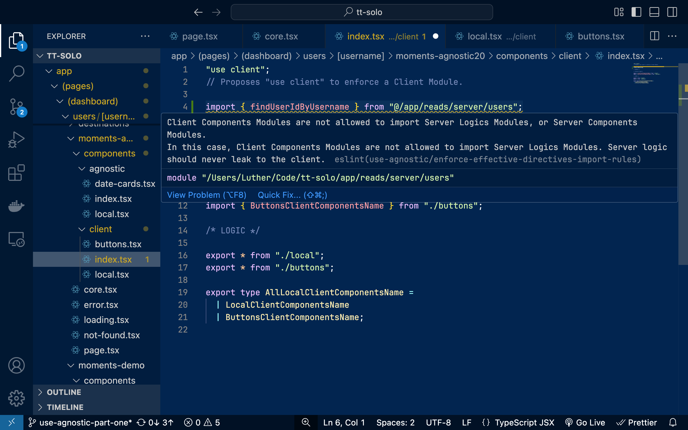

# eslint-plugin-use-agnostic

eslint-plugin-use-agnostic highlights problematic server-client imports in projects made with the Fullstack React Architecture (Next.js App Router, etc.) based on each of their modules' derived effective directives through detailed import rule violations, thanks to the introduction of its very own 'use agnostic' directive.

