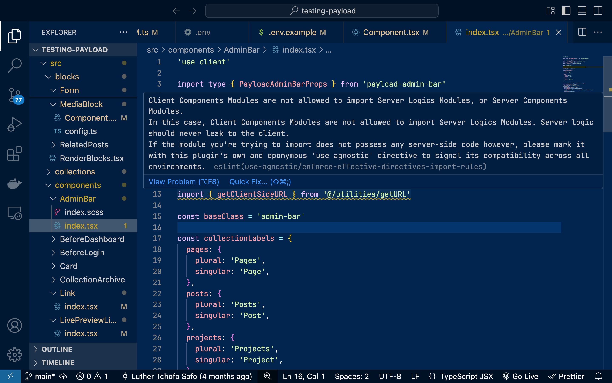

# eslint-plugin-use-agnostic

`eslint-plugin-use-agnostic` highlights problematic server-client imports in projects made with the Fullstack React Architecture (Next.js App Router, etc.) based on each of their modules' derived effective directives through detailed import rule violations, thanks to the introduction of its very own 'use agnostic' directive.



## Installation

```
npm install eslint@^9.0.0 eslint-plugin-use-agnostic --save-dev
```

## Setup (using TypeScript and the Flat Config)

```js
// eslint.config.js

import { defineConfig, globalIgnores } from "eslint/config";
import tseslint from "typescript-eslint"; // for compatibility with TypeScript, not included as a devDependency

import useAgnostic, {
  useAgnosticPluginName,
  agnostic20ConfigName,
} from "eslint-plugin-use-agnostic"; // no declaration file at this time

export default defineConfig([
  globalIgnores([".next", ".react-router", "node_modules"]),
  {
    // files: ['**/*.js', '**/*.jsx'], // if you're using vanilla JavaScript
    files: ["**/*.ts", "**/*.tsx"],
    plugins: {
      [useAgnosticPluginName]: useAgnostic,
    },
    extends: [`${useAgnosticPluginName}/${agnostic20ConfigName}`],
    languageOptions: {
      parser: tseslint.parser, // for compatibility with .ts and .tsx
    },
  },
]);
```

And don't forget the VS Code settings via `./.vscode/settings.json`:

```json
{
  "eslint.useFlatConfig": true,
  "eslint.validate": [
    "javascript",
    "javascriptreact",
    "typescript",
    "typescriptreact"
  ]
}
```
