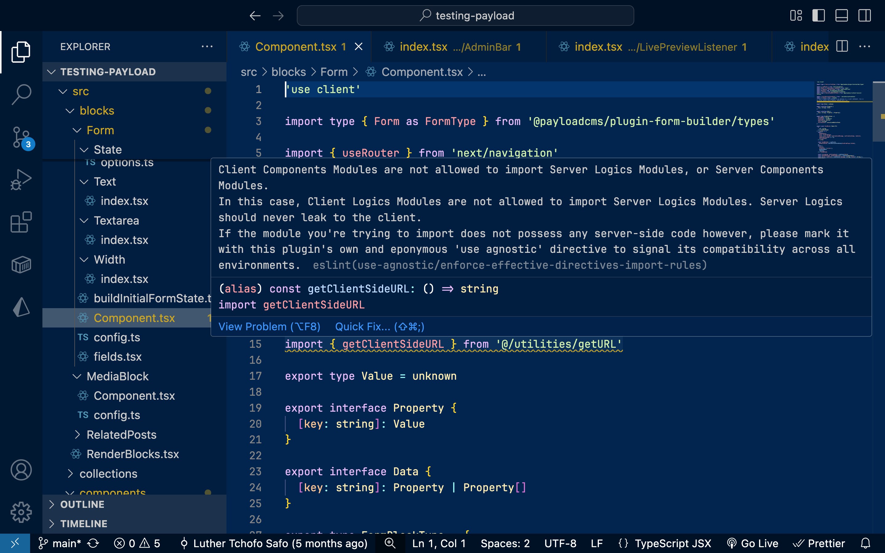

# eslint-plugin-use-agnostic

`eslint-plugin-use-agnostic` highlights problematic server-client imports in projects made with the Fullstack React Architecture (Next.js App Router, etc.) based on each of their modules' derived effective directives through detailed import rule violations, thanks to the introduction of its very own `'use agnostic'` directive.



## Installation

```
npm install eslint@^9.0.0 eslint-plugin-use-agnostic --save-dev
```

## Setup

```js
// eslint.config.js

import { defineConfig, globalIgnores } from "eslint/config";

import useAgnostic, {
  useAgnosticPluginName,
  agnostic20ConfigName,
  // enforceEffectiveDirectivesRuleName
} from "eslint-plugin-use-agnostic";

export default defineConfig([
  globalIgnores([".next", ".react-router", "node_modules"]),
  {
    files: [
      "**/*.tsx",
      "**/*.ts",
      "**/*.jsx",
      "**/*.js",
      "**/*.mjs",
      "**/*.cjs",
    ],
    plugins: {
      [useAgnosticPluginName]: useAgnostic,
    },
    extends: [`${useAgnosticPluginName}/${agnostic20ConfigName}`],
  },
]);
```

## How it works

In the beginning, there were not two kinds of modules in the Fullstack React Architecture (server vs. client). There were three:

- **Server Modules**
- **Client Modules**
- and Shared Modules, now **Agnostic Modules**

Shared Modules, which I've now renamed Agnostic Modules, are still here today. In fact, the React team originally anticipated that most modules used in conjunction with React Server Components would be Agnostic Modules. The problem is that Agnostic Modules are never surfaced between the current trifecta of `'use server'`, `'use client'`, and the lack of a directive:

- **`'use server'`** denotes modules that exclusively export Server Functions
- **`'use client'`** denotes modules that exclusively export code that is meant to be executed on the client
- and **the lack of a directive** implies that a module is server-first... until it isn't

This means that while `'use server'` denotes some special Server Modules but not all, and `'use client'` denotes all Client Modules regardless of their range of behaviors, the lack of a directive denotes both Server Modules that do possess server-side code, and Agnostic Modules that possess code that is neither server nor client and can safely run in both environments.

With the **`'use agnostic'`** directive, taking advantage of its being innocuous and entirely ignored by React at this time, it now becomes possible to manually distinguish between Server Modules, which are to remain unmarked by any directive in order to fullfill their server-first promise, and Agnostic Modules, which the `'use agnostic'` directive now allows to identify clearly; all with `eslint-plugin-use-agnostic` linting your project accordingly.

But it doesn't end there. With React Components into the mix (especially RSCs), the reality is that not all Server, Client, and Agnostic Modules are born the same. For example, though a Server Module exporting Server Components cannot import client-side logic, it can actually import and compose with Client Components. This is where a new distinction intervenes, one that particularly takes into account the file extensions of the modules at hand to establish a list of 7 known modules in the Fullstack React Architecture:

- **Server Logics Modules**, which _DO NOT_ export React Components, and _DO NOT_ use a JSX file extension
- **Server Components Modules**, which _ONLY_ export React Components (Server Components), and _ONLY_ use a JSX file extension
- **Server Functions Modules**, which _ONLY_ export Server Functions, and _DO NOT_ use a JSX file extension
- **Client Logics Modules**, which _DO NOT_ export React Components, and _DO NOT_ use a JSX file extension
- **Client Components Modules**, which _ONLY_ export React Components (Client Components), and _ONLY_ use a JSX file extension
- **Agnostic Logics Modules**, which _DO NOT_ export React Components, and _DO NOT_ use a JSX file extension
- **Agnostic Components Modules**, which _ONLY_ export React Components (Agnostic Components), and _ONLY_ use a JSX file extension

With this list established, it thus becomes possible to recognize static import violations between these 7 known modules that `eslint-plugin-use-agnostic` can now highlight for you in your code editor and in the CLI.

## Caveats

Only the first line of code in a file is observed for the presence of a directive. If no top-of-the-file directive is present or recognized, the file is considered to not have a directive, defaulting to being understood as a Server Logics Module if it doesn't use a JSX file extension (`.js`, `.ts`) or as a Server Components Module if it does (`.jsx`, `.tsx`).

Aliased import paths are resolved only if your ESLint config file and your `tsconfig.json` file are in the same directory. At least to my knowledge, since the resolution depends on the `cwd` property from ESLint rules' `context` objects.

It is up to you to confirm that your Agnostic Modules are indeed agnostic, meaning that they have neither server- nor client-side code. `eslint-plugin-use-agnostic`, at least at this time, does not do this verification for you.

It is also up to you to ensure, as outlined above, that **you do not mix** exporting React components with exporting other logics within the same module. Separating exporting React components within their own modules ending with a JSX file extension, from exporting other logics within modules that don't end with a JSX file extension, is crucial for distinguishing between Components Modules and Logics Modules respectively.

The import rules are designed to be as permissive as possible, allowing for more obscure use cases as long as they are non-breaking. However, it is still your responsibility as a developer to, within a file, not mix in incompatible ways code that cannot compose.

## Philosophy

I believe the core issue hindering the comprehension of React Server Components is the fact that the Fullstack React Architecture has entirely erased its own roots since the introduction of directives by disregarding the architecture's primordial realities I have detailed above: its Modules. Server Modules. Client Modules. Agnostic Modules.

`'use client'` may denote to the server that a module's exports are to be imported as client references. But that effectively makes said module a "`'use client'` module", and it's only natural that a "`'use client'` module" would behave in a `'use client'` way.

`'use server'` may denote to the client that a module's exports are to be imported as server references. But that effectively makes said module a "`'use server'` module", and it's only natural that a "`'use server'` module" would behave in a `'use server'` way.

React can easily understand that a `'use client'` module is, from a primordial standpoint, a Client Module. And it can also understand that a `'use server'` module is a Server Module, albeit a special one.

But not having a directive to distinguish between 1. non-special Server Modules that are never meant to be imported on the client, even as references; and 2. actual Agnostic Modules, the Shared Modules that are still here at the heart of this system and are able to run anywhere; this creates a confusion that is detrimental to every single stackholder in the RSC ecosystem:

- Developers are confused and have no idea what "Server" or "Client" means, since React doesn't make it crystal clear.
- LLMs are confused, because even they can't understand what 'use server' and 'use client' mean and therefore cannot explain it to developers facing their own specific concerns.
- And if LLMs are confused, I can't even imagine what that must mean for AI tools and AI agents.

This is what the `'use agnostic'` directive solves. It clearly marks a module to be an Agnostic Module. And if a module that used to lack a directive can now be marked as an Agnostic Module, this allows modules without a directive to finally, truly be Server Modules by default. And `eslint-plugin-use-agnostic` can work from there.

A lot more needs to be done, and a lot of it unfortunately can only be optimized deeper into React's innerworkings. But if the introduction of `'use agnostic'` can already create such powerful static analysis, imagine what it could produce if only it were incorporated into React as an official directive of the Fullstack React Architecture.
